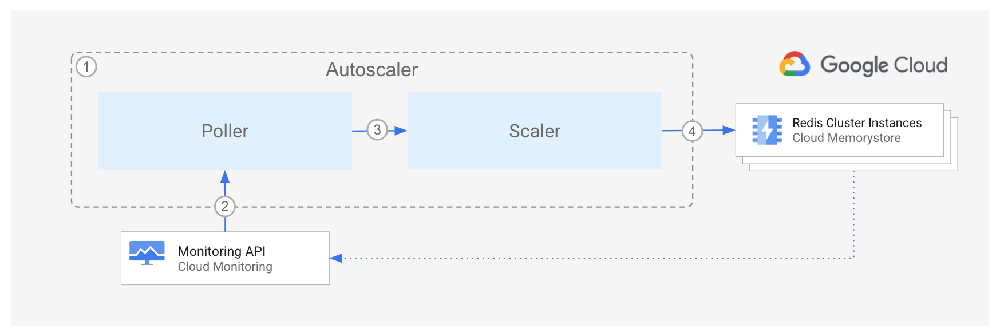

<br />
<p align="center">
  <h2 align="center">OSS Memorystore Cluster Autoscaler</h2>
  

  <p align="center">
    An open source tool to autoscale Memorystore Cluster instances
    <br />
    Home
    ·
    <a href="src/poller/README.md">Poller component</a>
    ·
    <a href="src/scaler/README.md">Scaler component</a>
    ·
    <a href="src/forwarder/README.md">Forwarder component</a>
    ·
    <a href="terraform/README.md">Terraform configuration</a>
    ·
    <a href="terraform/README.md#Monitoring">Monitoring</a>
  </p>
</p>

## Table of Contents

*   [Table of Contents](#table-of-contents)
*   [Overview](#overview)
*   [Architecture](#architecture)
*   [Deployment](#deployment)
*   [Configuration](#configuration)
*   [Licensing](#licensing)
*   [Contributing](#contributing)

## Overview

The Cloud Memorystore Cluster Autoscaler is a companion tool
that allows you to automatically increase or reduce the number of nodes/shards
in one or more Memorystore Cluster instances, based on their utilization.

When you create a [Memorystore Cluster instance][memorystore-cluster-instance],
you choose the number of [shards/nodes][compute-capacity] that provide compute
resources for the instance.

The Autoscaler monitors your instances and automatically adds or
removes capacity to ensure that the memory, CPU utilization, and other metrics
remain within recommend limits.

If you would like to get started quickly with a test deployment of the Autoscaler,
you can deploy to [Cloud Run functions in a single project][single-project-deployment].

## Architecture



The diagram above shows the high level components of the Autoscaler and the
interaction flow:

1.  The Autoscaler consists of two main decoupled components:
    *   [The Poller component][autoscaler-poller]
    *   [The Scaler component][autoscaler-scaler]

    These can be deployed to [Cloud Run functions][cloud-functions] and configured
    so that the Autoscaler runs according to a user-defined schedule.

2.  At the specified time and frequency, the Poller component queries the
    [Cloud Monitoring][cloud-monitoring] API to retrieve the utilization metrics
    for each Memorystore Cluster instance.

3.  For each instance, the Poller component pushes one message to the Scaler
    component. The payload contains the utilization metrics for the
    specific Memorystore Cluster instance, and some of its corresponding configuration
    parameters.

4.  Using the chosen [scaling method](src/scaler/README.md#scaling-methods),
    the Scaler compares the cluster instance metrics against the recommended
    thresholds, (plus or minus an [allowed margin](src/poller/README.md#margins)),
    and determines if the instance should be scaled, and the number of shards/nodes
    that it should be scaled to. If the configured cooldown period has passed, then
    the Scaler component requests the cluster to scale out or in.

Throughout the flow, the Autoscaler writes a step by step summary
of its recommendations and actions to [Cloud Logging][cloud-logging] for
tracking and auditing.

## Deployment

To deploy the Autoscaler, decide which of the following strategies
is best adjusted to fulfill your technical and operational needs:

*   [Deployment to Cloud Run functions](terraform/cloud-functions/README.md)
*   [Deployment to Google Kubernetes Engine (GKE)](terraform/gke/README.md)

In both of the above cases, the Google Cloud Platform resources are
deployed using Terraform. Please see the [Terraform instructions](terraform/README.md)
for more information on the deployment options available.

You can find some recommendations for productionizing deployment of the
Autoscaler in the [Productionization section](terraform/README.md#productionization)
of the Terraform documentation.

## Configuration

The parameters for configuring the Autoscaler are identical regardless of the chosen
deployment type, but the mechanism for configuration differs slightly:

In the case of the
[Cloud Run functions](terraform/cloud-functions/README.md#configuration) deployment,
the parameters are defined using the JSON payload of the PubSub message that
is published by the Cloud Scheduler job.

In the case of the
[Kubernetes deployment](terraform/gke/README.md#configuration), the parameters
are defined using a [Kubernetes ConfigMap][configmap] that is loaded by the Cron
job.

You can find the details about the parameters and their default values in the
[Poller component page][autoscaler-poller].

There is also a [browser-based configuration file editor and a command line
configuration file validator][configeditor].

## Licensing

```lang-none
Copyright 2024 Google LLC

Licensed under the Apache License, Version 2.0 (the "License");
you may not use this file except in compliance with the License.
You may obtain a copy of the License at

    https://www.apache.org/licenses/LICENSE-2.0

Unless required by applicable law or agreed to in writing, software
distributed under the License is distributed on an "AS IS" BASIS,
WITHOUT WARRANTIES OR CONDITIONS OF ANY KIND, either express or implied.
See the License for the specific language governing permissions and
limitations under the License.
```

## Getting Support

The Autoscaler project is based on open source contributions
(see [Contributing](README.md#contributing)).

Please note that this is not an officially supported Google product.

## Contributing

*   [Contributing guidelines][contributing-guidelines]
*   [Code of conduct][code-of-conduct]

<!-- LINKS: https://www.markdownguide.org/basic-syntax/#reference-style-links -->

[autoscaler-poller]: src/poller/README.md
[autoscaler-scaler]: src/scaler/README.md
[cloud-functions]: https://cloud.google.com/functions
[cloud-logging]: https://cloud.google.com/logging
[cloud-monitoring]: https://cloud.google.com/monitoring
[code-of-conduct]: code-of-conduct.md
[configeditor]: configeditor/README.md
[configmap]: https://kubernetes.io/docs/concepts/configuration/configmap
[compute-capacity]: https://cloud.google.com/memorystore/docs/cluster/cluster-node-specification
[contributing-guidelines]: contributing.md
[memorystore-cluster-instance]: https://cloud.google.com/memorystore/docs/cluster/memorystore-for-redis-cluster-overview
[single-project-deployment]: terraform/cloud-functions/per-project/README.md
